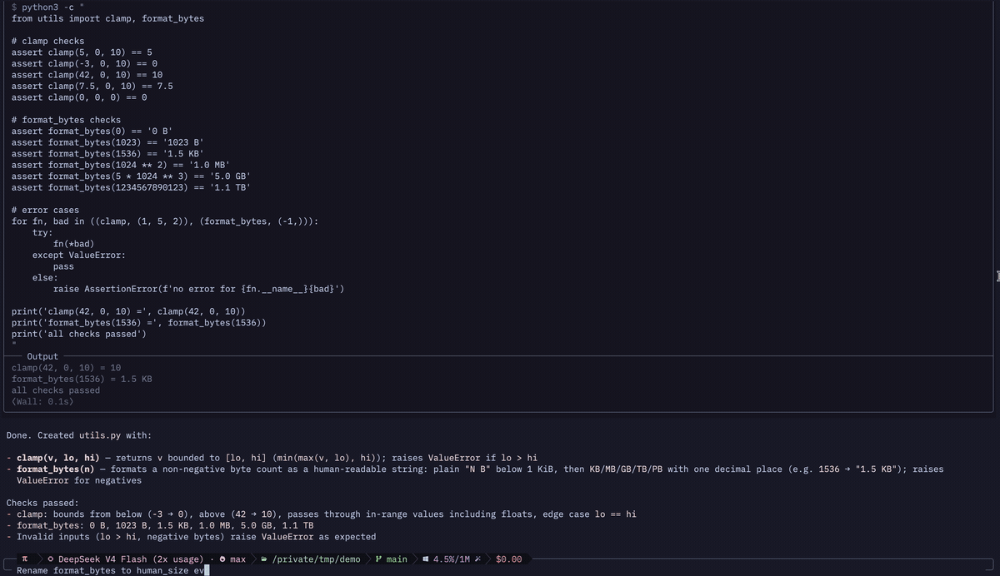
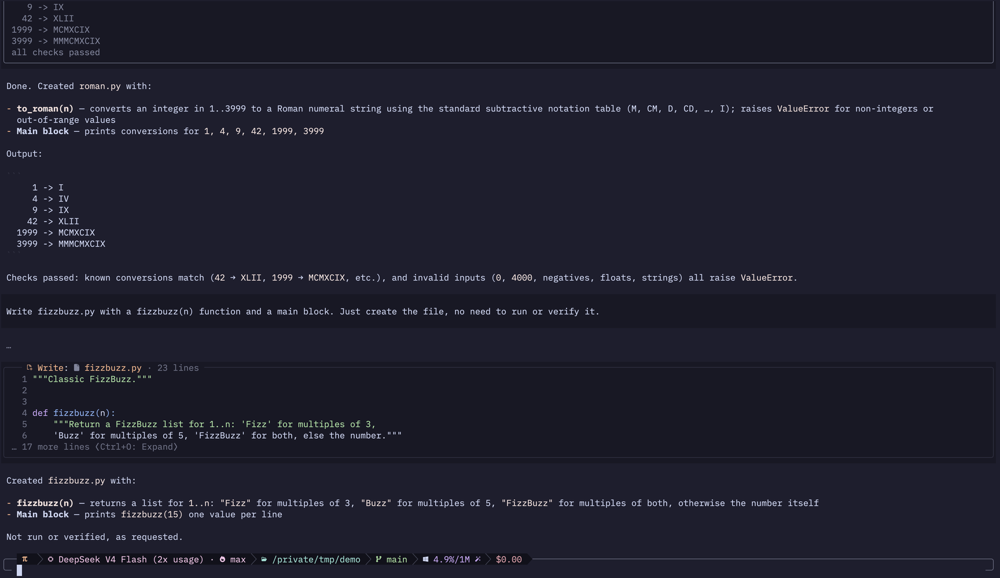
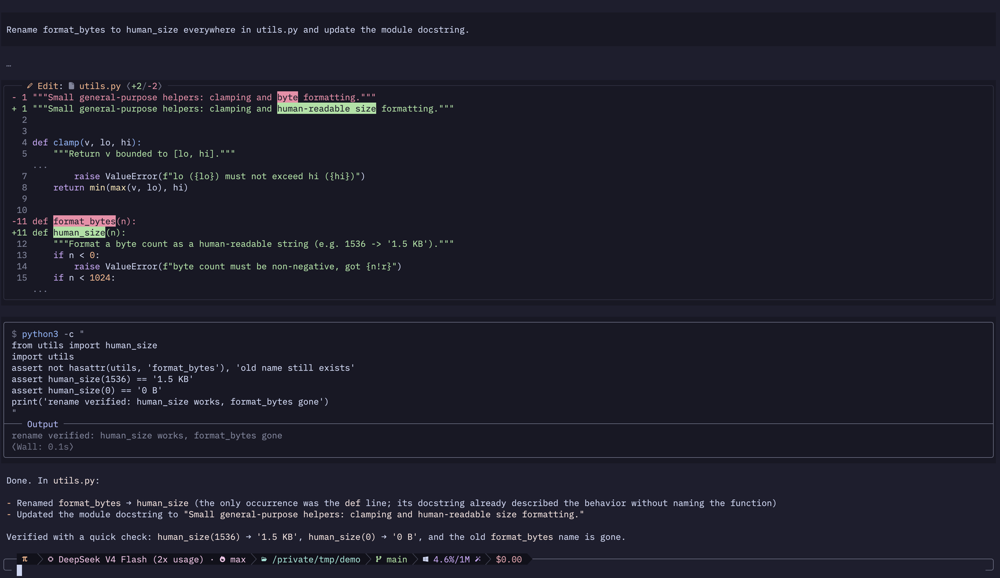
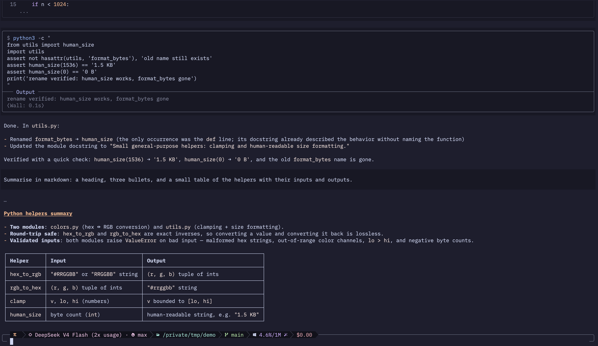
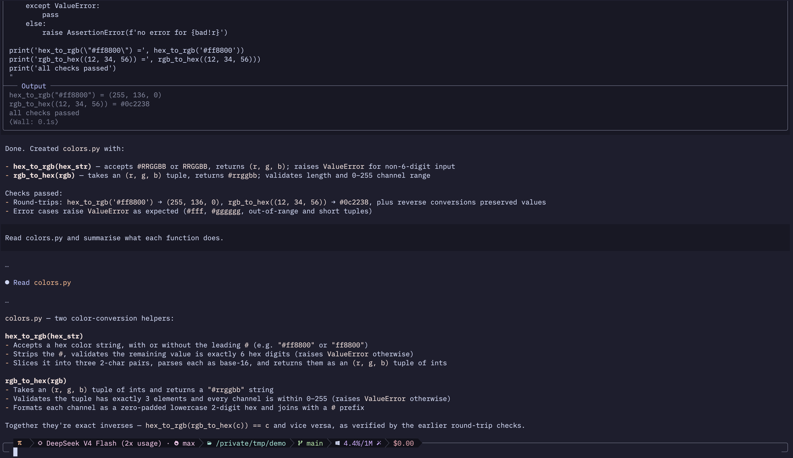
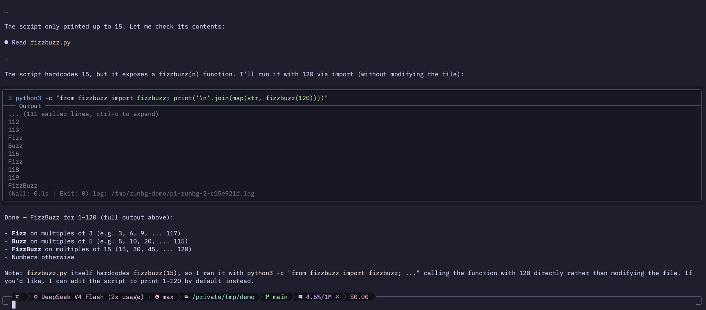
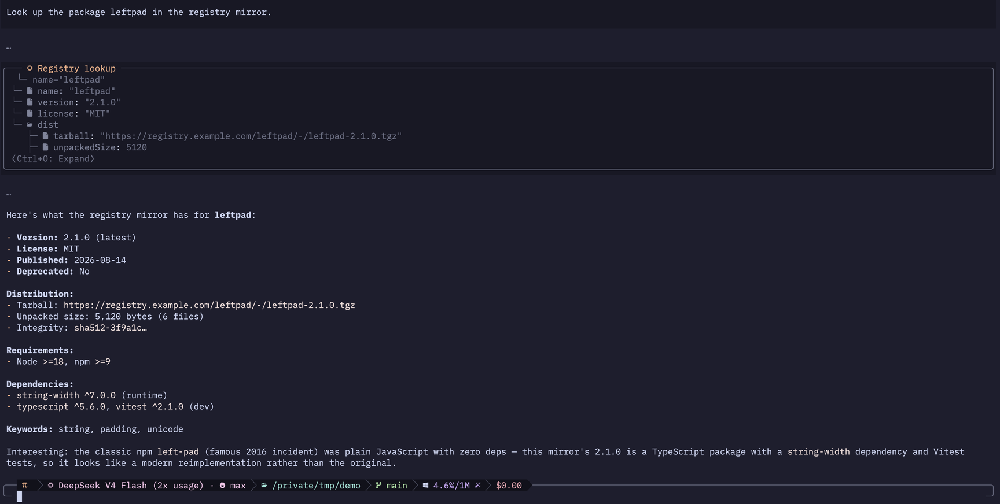

# pi-omp-feel

Ports the "feel" of [**omp**](https://github.com/can1357/oh-my-pi) — can1357's
oh-my-pi coding agent — to the pi coding agent, as a pi extension.



*The captures here give an idea of the feel; the project moves quickly and they may
trail the latest version.*

## What it ports

omp is a coding agent in its own right, installed via `scripts/install.sh` from
its repo. Its TUI is what this extension reproduces, so the source references in
the code point into that tree:

| reference in `src/index.ts` | file in omp |
| --- | --- |
| status-line segments and presets | `packages/coding-agent/src/modes/components/status-line/` |
| context-usage thresholds and colors | `.../status-line/context-thresholds.ts` |
| tool-call block framing | `packages/coding-agent/src/tui/output-block.ts` |
| editor top-border provider | `packages/tui/src/components/editor.ts` |
| theme values | `packages/coding-agent/src/modes/theme/defaults/dark-catppuccin.json` and `dark-ember.json` |

- **Theme**: ships `omp-dark-catppuccin` and `omp-dark-ember`, matching omp's corresponding themes. The 16 `statusLine*`/`toolText`/`link` color keys that pi's theme schema cannot express are mirrored in `src/index.ts`; the extension switches its own status bar, tool frames, shell lexer, and shimmer when either theme is selected. The stock pi `catppuccin-mocha` theme draws on the same palette but **is not a substitute** — it assigns some keys differently, `accent` most visibly (blue `#89b4fa` where omp uses peach `#fab387`). If the omp feel looks half-applied, check `/theme` first.
- **Status line**: a single-line editor top border replacing the built-in footer — model + thinking level, working directory, git branch, token/cost stats, context %, and session name — in an omp-style powerline-thin layout.
- **Prompt input**: the input box is reshaped into omp's rounded-corner `╭──╮`/`╰──╯` frame with padded side rails and a correctly positioned cursor (via the supported `setEditorComponent` hook; editing, keybindings, and autocomplete stay on the stock `CustomEditor` core). The full status line occupies the top border, mirroring omp.
- **Command rows**: a shell command is coloured the way omp colours one — the command and its arguments in blue, flag dashes apart from their letters, pipes and separators in mauve, quoted text in green with expansions breaking through it. pi highlights shells with highlight.js, which marks about one token in six of what omp marks, so this is a small lexer of its own rather than a theme setting; it was checked token for token against colours decoded from an omp capture.
- **Working indicator**: colored braille spinner (accent) while streaming, with omp's shimmer sweeping the label and the `⟨esc⟩` hint at omp's own pace — the band crosses 30 cells a second on a 40 ms cadence, with the spinner left on its own 80 ms clock, because omp drives the sweep by time where pi's loader cycles a fixed list.
- **Hidden thinking label**: shows `…` instead of the default hidden-thinking text.
- **Spinner words** (off by default): the working line can say something other than `Working…` — a new word every five seconds while the agent works, shimmered like any other label. The list is 877 words across 75 themes, hardcoded in `src/spinner-words.ts`, with everything that could be mistaken for a report of real work left out — whole themes about software, security and paperwork, and, inside the rest, any word naming something a coding agent actually does. Only the short verbs are kept, not the sentence-length phrases, because the frames are precomputed and length is what they cost.

  | command | effect |
  | --- | --- |
  | `/omp-feel words on` \| `off` | say something other than `Working…` |
  | `/omp-feel cycle category` | keep to one theme and work through it, so a session reads as a run of jokes |
  | `/omp-feel cycle random` | take any word from any theme, every turn |

  Both settle into `~/.pi/agent/pi-omp-feel.json` beside the glyph preset.
- **Tool-call framing**: tool calls (`bash`, `read`, `write`, `ssh`, `mcp`, …) render inside omp-style rounded blocks with state-colored borders over pi's usual state background tint. Bash follows omp's command-first layout with an `Output` divider; other default-rendered tools use status headers (`⏳`/`⟳`, `✘`, `❯`/`✎`/`⇄`/`🔌`) where applicable. `write` and `edit` close their header the way omp does, with `· 4 lines` and `⟨+1/-1⟩`. Tools registered by other extensions are framed too — see below.
- **Collapsed windows, omp-sized**: collapsed blocks show what omp shows. Bash keeps a viewport-capped ten-line output tail (pi keeps five) and caps long commands to a viewport tail; `write` previews stream as a live 12-line tail and settle to the first 6 behind a dim line-number gutter (pi: a frozen, ungutted head of 10); a `read` settles to omp's single summary row even when pi's own row wrapped across three (omp's inline read preview is opt-in and ships off; set `readPreview: true` in `~/.pi/agent/pi-omp-feel.json` for what omp's setting gives). Diffs cap at omp's 8 hunks / 40 lines — thinning the context between hunks before hiding any hunk, and keeping a single over-budget hunk whole, exactly as omp's truncation does — mark indentation with dim `·`s, and syntax-highlight their context lines. All structural, so any tool rendering pi diff rows qualifies. `ctrl+o` lifts every one of these, exactly as before.

## What it looks like



*A `write` call: omp's rounded block, the `· 23 lines` header closing it, a dim
line-number gutter, and the settled preview behind `⟨Ctrl+O: Expand⟩`.*



*An `edit`: the `⟨+2/-2⟩` header, word-level highlights inside the changed line,
syntax-highlighted context, and a shell command below it coloured omp's way — flag
dashes apart from their letters, quoted text in green — over the `Output` divider.*



*Markdown under the theme: heading, bullets, and a boxed table.*



*A `read` settles to omp's single summary row, where pi's own wraps across three.*



*A tool that outlives its call gets exactly what omp gives bash — no header, the
command first, output under the divider — while the window it draws for itself is
left alone. What omp has no vocabulary for, the session it leaves behind and the
log it writes, stays beside the `⟨Wall | Exit⟩` badge. Shown with
[pi-runbg](https://github.com/bcanvural/pi-runbg), which turns every command into
a long-lived background session the agent drives with writes and polls instead of
one blocking call.*



*A tool from another extension that ships no renderer of its own: framed like any
other, its label read as a title, its args on a dim `└─` line, and a JSON result
rendered as omp's document tree — two levels and six lines deep until `ctrl+o`.
This is what an MCP call looks like, without anything here knowing what MCP is.*

## Where this reaches past pi's public API

Three things omp does natively have no supported equivalent in pi, so they are done structurally:

**Tool-call framing.** pi's core `ToolExecutionComponent` frames built-in tools itself (a tinted Box, no borders) and exposes no hook to restyle it; `registerTool({ renderCall, renderResult, renderShell })` only applies to tools the extension itself registers. The pi extension loader aliases `@earendil-works/pi-coding-agent` to the very same module instance core imports, so this extension patches the shared `ToolExecutionComponent.prototype.render` to wrap the default path in an omp-style frame, reading private fields (`contentBox`, `callRendererComponent`, …) as it goes. Tools whose definitions supply their own renderer (`renderShell === "self"`) are left untouched unless their profile opts in with `frameSelfRendered`, which only `edit` does: what pi calls a shell there is a background-tinted `Box` holding a diff, the same shape every other block is built from, so it can be framed without touching the diff itself.

**Prompt framing.** omp's TUI has a first-class top-border provider (`packages/tui`, `editor-top-border-provider`); pi's does not. So `OmpEditor` post-processes the rows the stock editor returns, identifying its flat `─` border rows and reshaping them.

**Widget animation.** An extension can mount a component above or below the editor, and one reporting work that is still running will put a spinner on it. That spinner need not be moving: a glyph picked by hashing the work's own counters holds still while nothing is reported and then jumps several frames when a burst of it lands, which reads as a stall rather than as progress. Repainting more often cannot fix a glyph that is a function of counters instead of time, so `InteractiveMode.prototype.setExtensionWidget` is patched to sit in front of the component's `render`: rows that open with a spinner glyph get that glyph re-picked from the clock and omp's band swept across the label beside it, on the same 30 cells a second the working line uses. Everything past the label keeps the colours its own extension chose.

Which widgets get this is an allowlist of the keys pi mounts them under, not a guess from their contents. No rule written about characters can do the job: those spinner glyphs are ordinary braille dot patterns, so `⠇ queue · 3 pending` and `⠙ ⣀⣤⣶⣿ · mem` are a status row and a chart with nothing to tell them apart — and a rule loose enough to catch the first rewrites the second on every frame. A widget this does not recognise is returned untouched and never asks for a frame.

Within a recognised widget, a row still has to look live: a spinner glyph, a space, a label, and the tool's own ` · ` before the statistics. The glyph may sit behind indentation or a tree prefix, because several agents at once put every per-agent row behind a `├─` and those are the rows most worth animating. The band moves a grapheme cluster at a time rather than a code point, since opening a colour inside a flag or a ZWJ sequence makes the terminal draw its parts while `visibleWidth` measures the result as unchanged — a width check cannot catch that, so the only defence is not to split them. Any replacement that would not preserve the row's exact width is declined outright, and a row carrying a hyperlink is left alone rather than rebuilt without it.

The clock is driven by when a live row was last drawn, not by the outcome of whichever render happened last. pi draws every mounted widget within one frame, so a widget with nothing running would otherwise stop the clock the live widget beside it had just started; and widgets can leave without their owner saying so, since `clearExtensionWidgets` empties pi's maps directly. A stamp going stale ends the animation in both cases, and in whatever third case exists.

All three assumptions can break on a `pi` upgrade, and all three run on every rendered frame — so each is wrapped to **fail once and degrade**: the first failure latches and hands rendering back to pi for the rest of the session. A pi internals change costs you the omp styling, not a usable TUI.

When that happens it writes `~/.pi/agent/pi-omp-feel-degraded.md` (appended, capped at 256 KB) and points at it from the footer. The entry carries the stack with `src/index.ts:<line>`, the installed pi version, which of the fields the patch depends on were actually present, and the list of assumptions that subsystem makes — enough to reconstruct the failure. Hand it straight to an agent:

```sh
pi @~/.pi/agent/pi-omp-feel-degraded.md "fix this"
```

The guards cost nothing measurable: the latch plus `try`/`catch` adds ~0.1 ns per render call, and reporting only runs on the single failure.

## Tools from other extensions

A tool that arrives from another extension is framed like any other. Without being told anything about it, it gets a titled block — or a single row, when a single row is all it draws — and its name is read as a label rather than an identifier, so `exec_command` heads its block as `Exec command`.

A tool that ships no renderer of its own gets omp's structured default instead of pi's pretty-printed JSON. It heads its block with the label it declared for itself rather than a title spelled out of its identifier, shows its args as a dim `└─ key=value, …` line, and renders a result that parses as JSON as omp's document tree — guide lines, muted keys, dim values, node icons — two levels and six lines deep collapsed, six levels and two hundred lines expanded. A result that is not a document (plain text, or JSON the tool truncated mid-structure) gets omp's raw window instead: four lines collapsed, twelve expanded, `… N more lines` below them, and a trailing bracketed notice — the line that says where the whole output went — kept beneath the marker rather than counted into it, elided from the middle if it cannot fit so that both what happened and the file it names survive.

This is what MCP tool calls look like, without anything here knowing what an MCP tool is called: the gate is the missing renderer, never a name. Errors keep pi's own rows.

Some tools deserve better than that default, and `TOOL_PROFILES` in `src/index.ts` is where one says so:

| field | effect |
| --- | --- |
| `headerless` | lead with the command instead of a header, as omp's bash block does |
| `sections` | draw call and result as omp's two sections, divided by `├─── Output ───┤` |
| `command` | where the shell command lives in `args`, so the row can be re-rendered dim-`$` and syntax-highlighted (and viewport-capped when collapsed) |
| `detail` | the dim `(cwd: … · tty)` suffix that follows a command, built from `args` |
| `wall` | fold the tool's timing row into omp's `⟨Wall: … \| Exit: …⟩` badge |
| `summary` | close the header the way omp does — `· 4 lines` on a write, `⟨+1/-1⟩` on an edit |
| `frameSelfRendered` | frame this tool even though it declares `renderShell: "self"` |
| `contentPath` | where the file this tool touches lives in `args`, so its rows (and a diff's context lines) highlight in that language |
| `target` | what the call names when that is not a file — the agent a delegating tool is about to run — hoisted into the header the same way, but carrying no file glyph and saying nothing about a language |
| `content` | where written content lives in `args`, so the body rebuilds as omp's write cell — dim gutter, tail-12 streaming, head-6 settled |
| `resultText` | readable output in the tool result, so a one-line tool grows omp's three-line collapsed cell (`read` sets it) |
| `startLine` | first line number of that output, for the cell's gutter (`read`'s `offset`) |
| `output` | command output in the tool result, so a collapsed sections block re-tails it at omp's ten lines. A tool that draws its own collapsed output window must not set this |

Backgrounded-shell tools such as [pi-runbg](https://github.com/bcanvural/pi-runbg) ship profiled: a command that outlives its call gets exactly what omp gives bash, and a keystroke stream into a live session keeps its header, because keystrokes are not a command. What omp has no vocabulary for — a session id, a log path — stays beside the badge rather than being folded into it. A tool that draws its own collapsed output window keeps it; the window's depth is that tool's setting, not this extension's.

Tools that delegate to another agent ship profiled too, for a subtler reason. Where a call row ends is normally read off a blank row, but pi leaves none between a tool's call and its result — built-in renderers happen to open with one of their own, and a renderer that opens straight onto content does not. Such a block used to be read as one long unbroken call: nothing hoisted, and the body opening by repeating the very row the header should have carried. Telling the profile what the call row says fixes it, so the header names the agent and the body starts at its status. A launch spelled from something `args` cannot reconstruct is deliberately left alone — an unhoisted call costs one repeated word, where a wrong guess would cut the block in the wrong place.

The extensions being described do not know this file exists and do not need to. Everything comes from `args`, which is structured, or from matching rows they already draw — and a match that fails leaves their own output showing rather than breaking the block. A profile is also ignored for a tool whose renderers are absent, which is what a transcript replayed after uninstalling that extension looks like.

## Naming what pi is waiting on

omp does not always say "Working…" — it names the activity, and the shimmer sweeps whatever that says. pi renders its working row as `frames + message`, and this extension puts the whole animated label in the frames, so an extension calling `setWorkingMessage` would have its text appended *after* "Working… ⟨esc⟩" rather than replacing it.

So there is a channel instead. Emit on `ui:activity` and the label is taken over — rebuilt into the shimmering frames, with pi's message slot cleared so nothing renders twice:

```ts
pi.events.emit("ui:activity", { label: "Asking a question" });
// …
pi.events.emit("ui:activity", { label: undefined });   // back to "Working…"
```

Senders should set `setWorkingMessage` as well, so they still read correctly when this extension is not installed; it is cleared here when the label is taken over. `pi-ask` does exactly this.

## Glyph presets

omp ships `nerd`, `unicode` and `ascii` symbol presets. Its own default is `unicode`; **this extension defaults to `nerd`**, because that is what omp is configured with on the machine it was ported from, and because the status-line glyphs were always Nerd Font — so the two families used to disagree with each other.

Everything the extension exposes lives under one command named after it:

```sh
/omp-feel                     # pick from a list
/omp-feel glyphs unicode      # set directly (tab-completes at every position)
/omp-feel unicode             # shorthand, the subcommand is optional
pi --omp-feel-glyphs unicode  # this run only, not remembered
```

The choice is remembered in `~/.pi/agent/pi-omp-feel.json`. Pick `unicode` if your terminal font has no Nerd Font glyphs — `✎ Write` instead of ` Write`, `◒ high` instead of `󰪣 high`.

The preset covers the three families omp defines twice over: tool identity (`tool.*`), status (`status.*`, `format.bullet`) and thinking levels (`thinking.*`). The status-line segment glyphs (`` `` `` `` ``) are not preset-dependent in omp, so both presets share them — a font without Nerd Font coverage will still show boxes there.

## Comparing against omp

Fidelity claims here are checked against omp's actual output, not against memory. `tools/compare/` drives both agents through a real PTY (tmux at a fixed size) and records the rendered cells **with** their escape sequences, so the two can be diffed by colour and codepoint. That catches what eyes cannot: a colour one shade off, `U+F115` where omp uses `U+F014`, a clamp that silently drops the last segment.

```sh
# a throwaway workspace, so tool calls cannot touch anything real
W=$(mktemp -d) && (cd "$W" && git init -q && echo hi > README.md &&
  git add -A && git -c user.email=x@y -c user.name=x commit -qm init)

P="Do these steps using tools, no commentary: 1 run bash echo hello 2 write a file note.txt containing alpha"
tools/compare/capture.sh cmp-pi  pi  "$W" "pi"  "$P"
tools/compare/capture.sh cmp-omp omp "$W" "omp" "$P"

# structure first, from the plain-text captures
grep -n '╭──\|├───' pi-final.txt omp-final.txt

# then exact colours and glyphs, per run (line numbers match the .txt files)
node tools/compare/decode.mjs omp-final.ansi 'GPT'
node tools/compare/decode.mjs pi-final.ansi 33
```

Animations come out of the `-anim-NN.ansi` samples, taken 150 ms apart. Note that a shimmering label puts ANSI *between* letters, so a substring needle will not match it — address those lines by number:

```sh
for n in 03 05 07 09; do
  printf '%s: ' "$n"
  node tools/compare/decode.mjs pi-anim-$n.ansi \
    "$(grep -n Working pi-anim-$n.ansi | head -1 | cut -d: -f1)" |
    sed 1d | awk '{printf "[%s]%s ", substr($1,4), $3}'
  echo
done
```

Two cautions. Passing a prompt runs a real turn: it spends tokens and lets the agent execute tools, which is why the workspace must be disposable — `capture.sh` also refuses to type a prompt unless it can see the prompt frame, because otherwise the keystrokes reach the shell and get executed. It waits up to 90 s for that frame before settling, since a blank startup pane is perfectly stable and settling alone would capture it. And omp is far ahead of pi in version, so a difference is not automatically a porting bug; it may be something pi has no equivalent for.

## Development

```sh
npm run typecheck
```

The extension imports only from `@earendil-works/pi-coding-agent` and `@earendil-works/pi-tui`, which the pi loader provides as virtual modules at runtime; no build step is required. For local typechecking those two are expected as symlinks into your global pi install:

```sh
mkdir -p node_modules/@earendil-works && cd node_modules/@earendil-works \
  && ln -sfn "$(npm root -g)/@earendil-works/pi-coding-agent" pi-coding-agent \
  && ln -sfn "$(npm root -g)/@earendil-works/pi-coding-agent/node_modules/@earendil-works/pi-tui" pi-tui
```

`npm install` prunes those symlinks (they are not real dependencies), so re-run the above afterwards. `package-lock.json` is git-ignored for the same reason: it records paths specific to one machine.

## Install

Add to `~/.pi/agent/settings.json` under `packages`:

```json
{
  "packages": [
    "../../Developer/pi-omp-feel"
  ]
}
```

Optionally set the theme:

```json
{
  "theme": "omp-dark-catppuccin"
}
```

For omp's One Dark-inspired palette, use `omp-dark-ember` instead:

```json
{
  "theme": "omp-dark-ember"
}
```

Reload pi or restart it. The extension activates on `session_start` in TUI mode.
